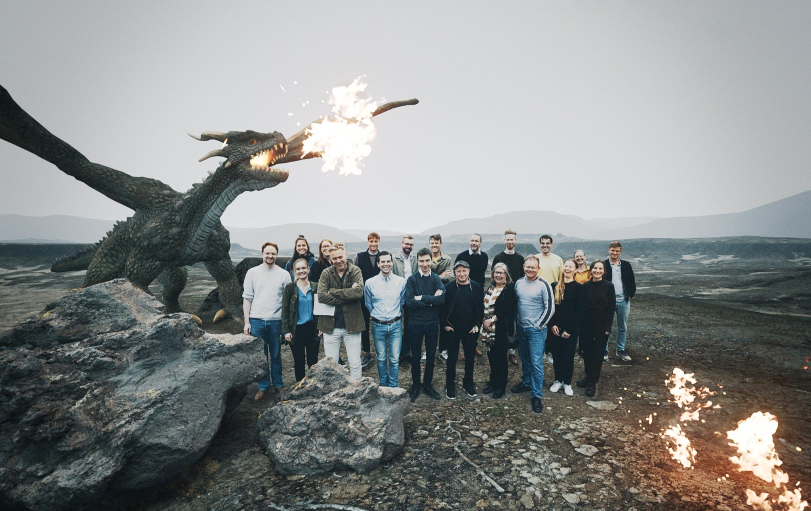

The Gothenburg Research Group on Elections, Public Opinion and Political Behavior (GEPOP) is an umbrella organisation at University of Gothenburg for researchers devoted to the study of elections, public opinion and political behavior. Together with  Henrik Ekengren Oscarsson I am responsible for co-ordinating GEPOP activities. GEPOP members join efforts to organize networking activities such as morning meetings, seminar series, conferences and workshops. 

GEPOP was founded in 2019, but political behavior research has a long tradition at the Gothenburg department, tracing back to the first election studies conducted in the 1950:s. In that sense we follow the University of Gothenburg’s motto: "Tra:dita inno’va:re inno’va:ta ’tradere" --- To renew what has been passed on and pass it on renewed.

We organize a seminar at Tuesdays every second week, breakfast meetings every Friday and internal workshops. You can see some pictures from our previous adventures below.

