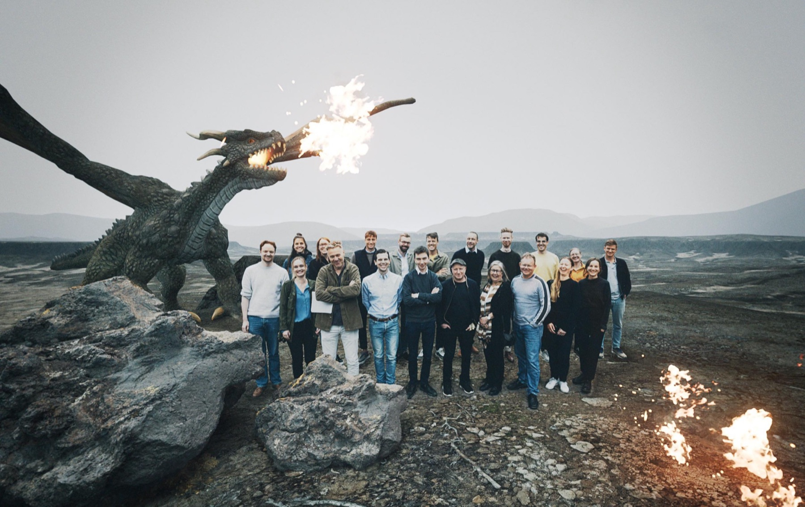
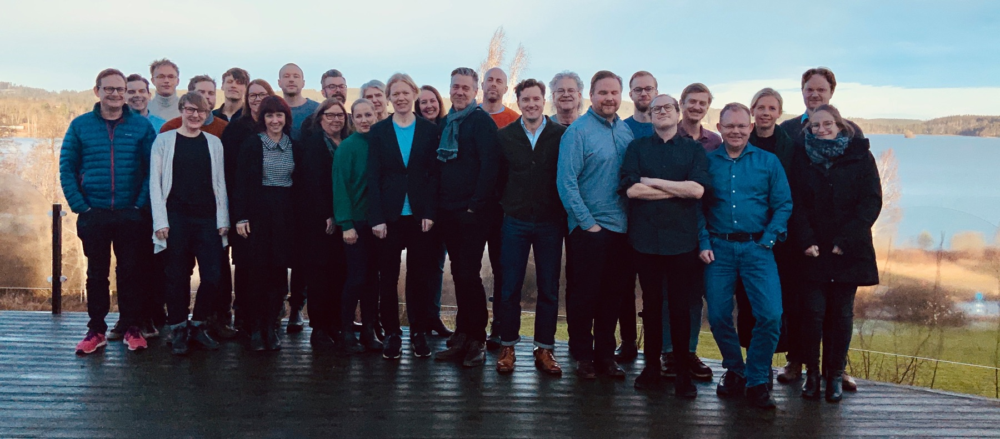

# About

The Gothenburg Research Group on Elections, Public Opinion and Political Behavior (GEPOP) is an umbrella organization at the University of Gothenburg for researchers studying elections, public opinion and political behavior. The group was founded in 2019 and builds on a long tradition of political behavior research at the Department of Political Science, dating back to the first election studies conducted in the 1950s.

# Coordination

GEPOP is led by Mikael Persson.

# Activities

- Seminar series, every second Tuesday
- Breakfast meetings, every Friday
- Internal workshops
- Conferences and other networking activities

