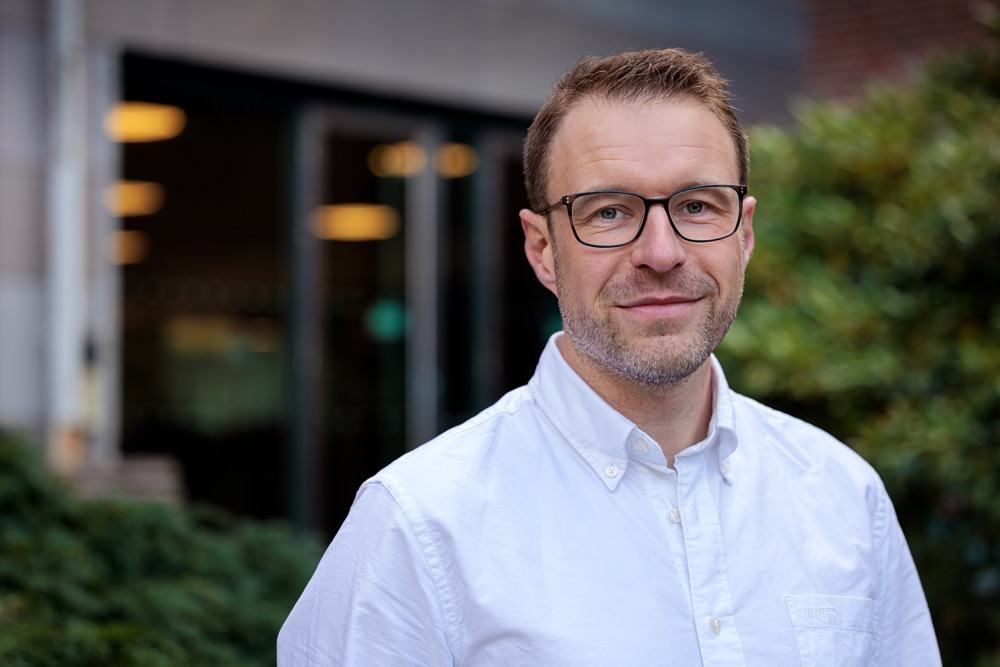

# Om mig

Jag heter Mikael Persson och är professor vid [Statsvetenskapliga institutionen, Göteborgs universitet](https://www.pol.gu.se). Min forskning handlar om politiskt beteende, opinion och politisk representation: hur medborgares åsikter påverkar politiken, vilka som blir hörda och hur väljare fattar sina beslut.

Jag leder forskargruppen [GEPOP](https://www.gu.se/forskning/gothenburg-research-group-on-elections-public-opinion-and-political-behavior-gepop), som studerar val, opinion och politiskt beteende.

Mina vetenskapliga publikationer finns på den [engelska versionen av sidan](index.html). Mitt CV på svenska kan du [ladda ner som pdf](tredje.pdf).

# Vad jag arbetar med

Jag arbetar till exempel med:

- **Opinion och politik:** hur väl politiska beslut följer folkopinionen, och varför vissa grupper, framför allt de med högre inkomst, får större genomslag än andra.
- **Väljare och ekonomi:** hur väljare bedömer regeringar och hur de reagerar på tillväxt, arbetslöshet, inflation och börsutveckling.
- **Utbildning och deltagande:** hur utbildning påverkar politiskt engagemang och politiska attityder, särskilt bland unga.
- **Val och partival:** valdeltagande och hur väljare väljer parti, i Sverige och i jämförelse med andra demokratier.

**Kontakt:** [mikael@mikaelpersson.org](mailto:mikael@mikaelpersson.org)

<a href="mailto:mikael@mikaelpersson.org"><i class="fa-solid fa-envelope"></i></a>
<a href="https://orcid.org/0000-0002-5377-2173"><i class="fa-brands fa-orcid"></i></a>
<a href="https://scholar.google.se/citations?user=CuC_-GQAAAAJ&hl=sv"><i class="fa-brands fa-google"></i></a>

[English](index.html)
