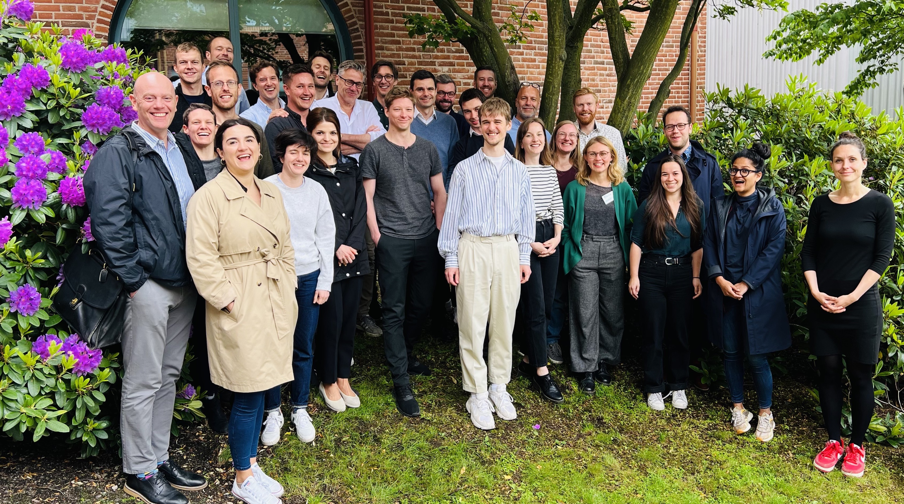
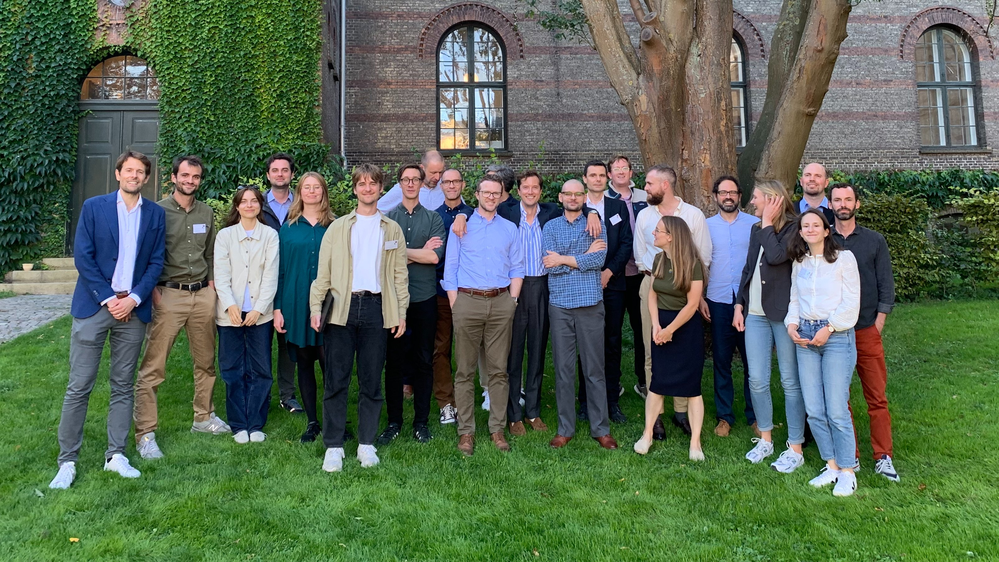

Together with Love Christensen, Peter Thisted Dinesen and Henning Finseraas, I have founded the Nordic Workshop on Political Behavior (with inspiration from the Toronto Political Behavior Workshop). So far we have held three workshops in Gothenburg, 2020 and 2022, in Copenhagen 2023 and in Aarhus 2024. In 2025 we will organize the fifth workshop in Trondheim, Norway.

# CALL FOR PAPERS TRONDHEIM OCTOBER 2025

Following the workshops in 2020-2024, we are happy to invite proposals to the 5th Nordic Political Behavior Workshop. The workshop takes place at the Department of Sociology and Political Science, NTNU Trondheim, Norway, on October 2-3, 2024.

The two-day workshop is dedicated to in-depth feedback on a smaller set of papers researching political behavior broadly defined (including, but not limited to, the adjacent subfields of political psychology, public opinion, and political representation). We welcome scholars applying all types of methods and data, and the workshop has no specific regional emphasis. The format is especially well-suited for papers that answer substantial questions about political behavior using innovative methods or new data.

We expect to discuss approximately 10 papers. Each paper will be assigned an hour for discussion. Non-presenting scholars are also welcome as the discussion of the papers will be of relevance beyond the specific papers. Based on the previous workshops, we expect 30-35 participants.

The workshop is intended to bring together Nordic and international scholars within the field and we strongly encourage participation from people of all ranks and backgrounds. In addition to providing feedback, the workshop is intended to provide an opportunity to connect with new people—especially for junior scholars.

Participation in the workshop is free of charge and lunch and refreshments are provided for participants on both days of the workshop. On October 2, there is a workshop dinner for presenters. We also expect to be able to provide some financial support for accommodation for presenters. Supporting presenters without access to funding will be given priority. Participants must cover their own travel.

Submit your abstract here by May 10. We expect decisions to be made by late-May.

[Submit your paper here](https://docs.google.com/forms/d/e/1FAIpQLSfZLil5Rw4DGzD96xNYz0QgCeHCW2eRTzo2T8L93ZB8L5yezg/viewform)

Organizers:

Henning Finseraas (Norwegian University of Science and Technology)

Love Christensen (University of Gothenburg & Aarhus University)

Peter Thisted Dinesen (University of Copenhagen)

Mikael Persson (University of Gothenburg)

# NPBW 2020 GOTHENBURG

Participants 2020:

Elin Naurin
Rune Slothuus
Jennifer Oser
Maria Solevid
Andreas Kotsadam
Moa Frödin-Gruneau
Karl-Oskar Lindgren
Sven Oskarsson
Mattias Agerberg
Max Schaub
Henning Finseraas
Aina Gallego
Laura Lungu
Peter Loewen
Love Christensen
Martin Larsen
Mikael Persson
Licia Bobzien
Julia Schulte-Cloos
Peter Dinesen
 
# NPBW 2022 GOTHENBURG

Participants 2022:

Alexandra Jabbour 
Peter Thisted Dinesen
Krisztina Szabó
Ellen Lust
Kellstedt 
Clara Vandeweerdt
Jana Schwenk
Sven Oskarsson
Rafael Ahlskog
Aaron Weinschenk.
Anders Sundell
Apurav Yash Bhatiya
Henning Finseraas
Christoffer Hentzer Dausgaard 
Love Christensen
Nina Serdarevic
Peter Esaiasson
Markus Kollberg
Ann-Kristin Kölln
Sebastian Jungkun
Andrej Kokkonen
Søren Damsbo Svendsen
Elena Leuschner

# NPBW 2023 COPENHAGEN

#  Motivation

Recent years have seen an increase in innovative political behavior research building on a variety of theories, data and research designs. Nordic political behavior researchers have been part of this development, in particular through the use of the high-quality electoral studies and rich administrative data available in the Scandinavian countries. However, we believe that the research environments around political behavior in the Nordic countries have been too isolated from each other and would benefit from closer contact. To facilitate a stronger connection, both within the Nordic countries, but also to the outside community, we organize the Nordic Workshop on Political Behavior. The workshop is decidedly not restricted to Nordic researchers or Nordic data, but seeks to bring together Nordic and international scholars within the field.

#  Purpose

A critical factor in the realization of novel ideas is high-quality feedback from peers. We want to create a forum for such feedback by means of a 2-day workshop dedicated to research on political behavior.
The workshop applies a broad definition of “political behavior” including, e.g., political psychology, public opinion and representation research. We welcome scholars applying all types of methods and data, and we have no specific regional emphasis.

The purpose of the workshop is to provide high-quality feedback on a smaller set of papers (we expect about 10). To realize this ambition, participants are expected to read the selected papers in advance of the workshop to be able to provide qualified feedback. The decision to focus on a smaller set of papers entails fewer presenters, but we hope to also attract non-presenting scholars, as the discussion of the papers will be of relevance beyond the specific papers.
We strongly encourage participation from people of all ranks and backgrounds. In addition to academic sparring, the workshop is intended to provide an opportunity to connect with new people—especially for junior scholars.
