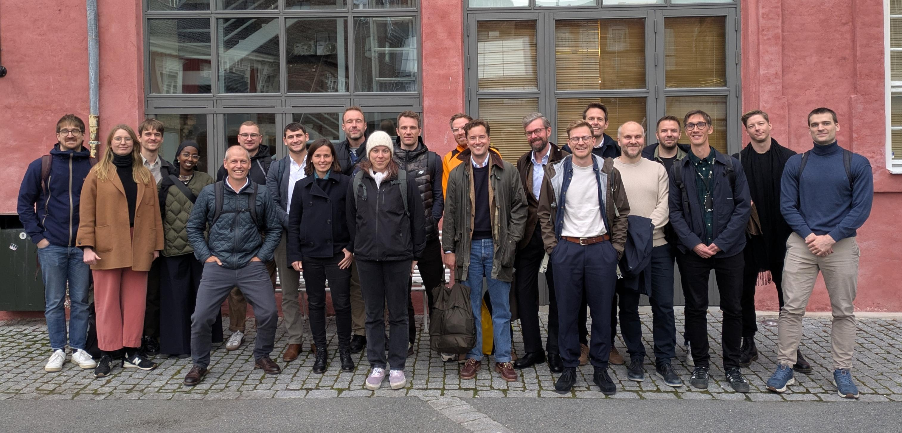
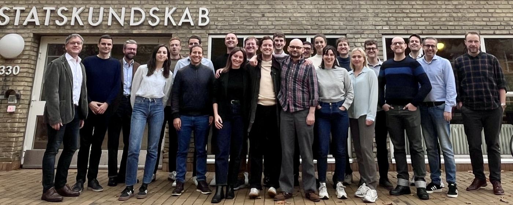
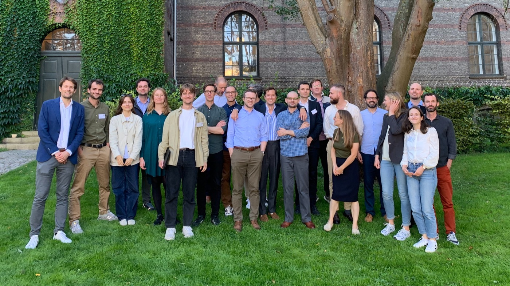
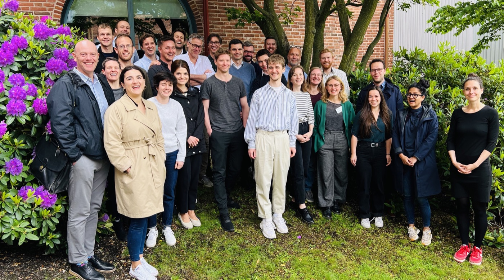
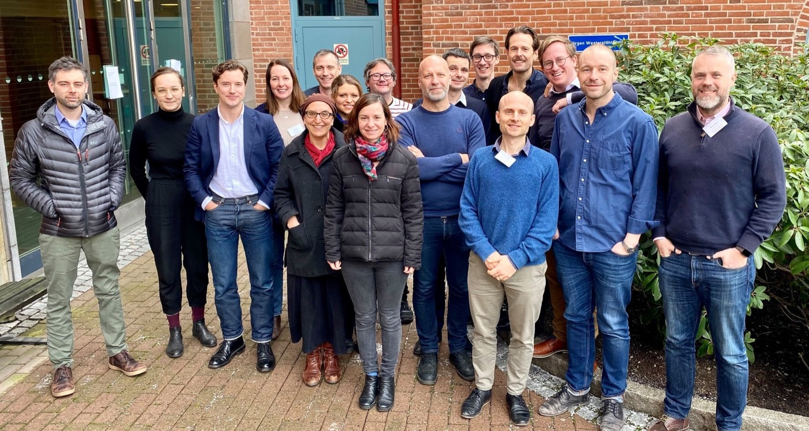

Together with Love Christensen, Peter Thisted Dinesen and Henning Finseraas, I have founded the Nordic Political Behavior Workshop (with inspiration from the Toronto Political Behavior Workshop). So far we have held five workshops.

# NPBW 2025 TRONDHEIM

# NPBW 2024 AARHUS

# NPBW 2023 COPENHAGEN

# NPBW 2022 GOTHENBURG

# NPBW 2020 GOTHENBURG

#  Motivation

Recent years have seen an increase in innovative political behavior research building on a variety of theories, data and research designs. Nordic political behavior researchers have been part of this development, in particular through the use of the high-quality electoral studies and rich administrative data available in the Scandinavian countries. However, we believe that the research environments around political behavior in the Nordic countries have been too isolated from each other and would benefit from closer contact. To facilitate a stronger connection, both within the Nordic countries, but also to the outside community, we organize the Nordic Workshop on Political Behavior. The workshop is decidedly not restricted to Nordic researchers or Nordic data, but seeks to bring together Nordic and international scholars within the field.

#  Purpose

A critical factor in the realization of novel ideas is high-quality feedback from peers. We want to create a forum for such feedback by means of a 2-day workshop dedicated to research on political behavior.
The workshop applies a broad definition of “political behavior” including, e.g., political psychology, public opinion and representation research. We welcome scholars applying all types of methods and data, and we have no specific regional emphasis.

The purpose of the workshop is to provide high-quality feedback on a smaller set of papers (we expect about 10). To realize this ambition, participants are expected to read the selected papers in advance of the workshop to be able to provide qualified feedback. The decision to focus on a smaller set of papers entails fewer presenters, but we hope to also attract non-presenting scholars, as the discussion of the papers will be of relevance beyond the specific papers.
We strongly encourage participation from people of all ranks and backgrounds. In addition to academic sparring, the workshop is intended to provide an opportunity to connect with new people—especially for junior scholars.
